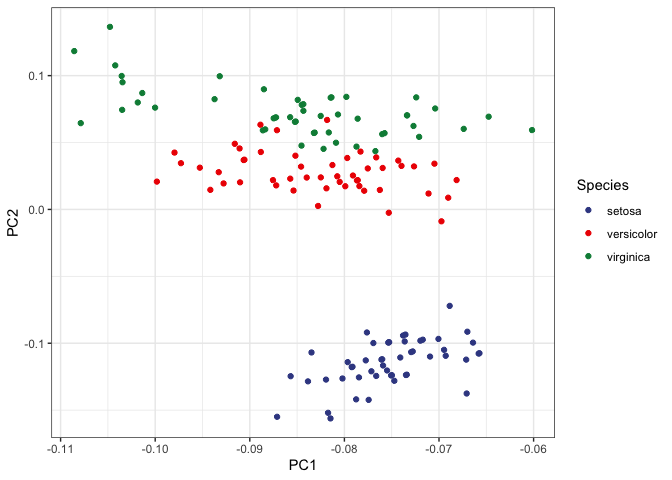
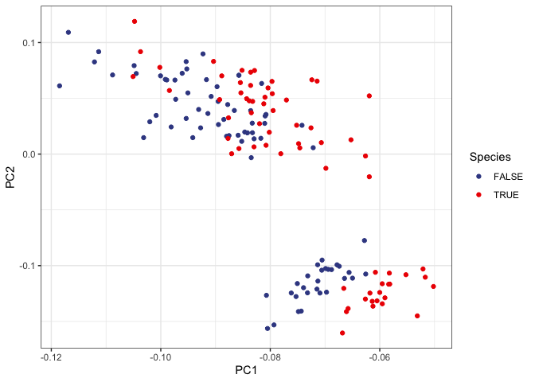

Kmeans Clustering
=================

Step 1. Choose the K number of clusters.

Step 2. Split the data randomly into K groups.

Step 3. Iterate the following until the cluster assignments stop
changing or until the predetermined number of iterations:

1.  For each of the K clusters, compute the cluster centroid. The kth
    cluster centroid is the vector of the p feature means for the
    observations in the kth cluster.
2.  Assign each observation to the cluster whose centroid is the
    closest.

Here we will work with the Iris data.

    data(iris)

    iris_data <- iris %>% 
      select(c(Sepal.Length, Sepal.Width, Petal.Length, Petal.Width))

Step 1. Choose K number of clusters:
------------------------------------

    K <- 2

Step 2. Split the data randomly into K groups:
----------------------------------------------

    set.seed(10)
    # Randomly assign a number, from 1 to K, to each of the observations. 
    rand_idx <- sample(c(TRUE, FALSE), nrow(iris_data), replace=TRUE, prob=c(0.5, 0.5))

    iris_data$cluster_id <- rand_idx

